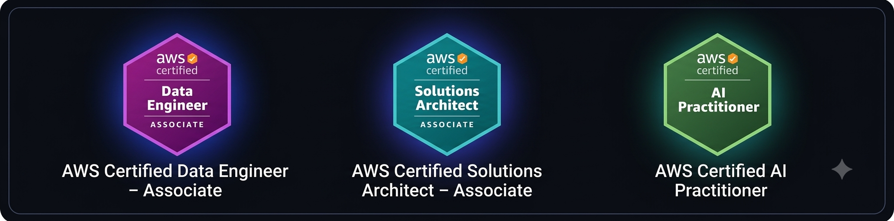
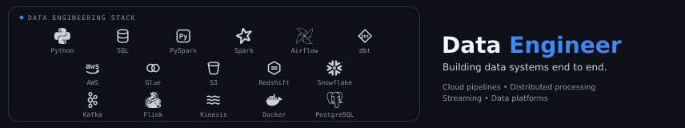

<table>
<tr>
<td width="220" align="center">

</td>

<td>

# ABINAV S.

### DATA ENGINEER

Building cloud data pipelines, distributed processing workflows, and analytical data platforms with Python, SQL, PySpark, AWS, and modern data engineering tools.

`Python` `SQL` `PySpark` `AWS` `Airflow` `Glue` `Redshift` `Snowflake`

[GitHub](https://github.com/abii-18) ·
[LinkedIn](https://www.linkedin.com/in/abinav-s18/) ·
[Email](mailto:abinavv018@gmail.com)

</td>
</tr>
</table>

 

---

## About

Data Engineer with ~2.5 years of professional experience plus a 3-month internship at **Virtusa**, working extensively with AWS-based data engineering systems in the banking and financial-services domain.

Professional work spans enterprise ETL workflows, Airflow orchestration, AWS Glue transformations, S3 data movement, Redshift loading, and production pipeline monitoring.

Alongside professional work, I build end-to-end data engineering projects to deepen my experience with **PySpark, Apache Spark, Snowflake, dbt, Airflow, AWS, and streaming architectures**.

---

## Certifications

  

---

## Stack

  

---

## Data Engineering in Banking

Professional experience delivering data engineering work for **Bank of Montreal (BMO)** at Virtusa, within a banking and financial-services environment.

<table>
<tr>

<td width="50%" valign="top">

- Enterprise ETL workflows
- Financial data processing
- AWS-based data platforms
- Airflow DAG orchestration
- Glue-based transformations

</td>

<td width="50%" valign="top">

- S3 data movement
- Redshift loading
- CloudWatch monitoring
- SNS alerting
- Data validation
- Failure investigation and root-cause analysis

</td>

</tr>
</table>

My experience includes working with production data pipelines across ingestion, transformation, orchestration, monitoring, validation, and downstream analytical processing.

---

## Featured Projects

### Retail Sales Lakehouse

End-to-end batch data engineering project demonstrating ingestion, orchestration, layered processing, data quality, cloud storage, warehousing, and dimensional modeling.

**Architecture**

`PostgreSQL → Airflow → S3 → AWS Glue → Snowflake → dbt`

**Technology**

`Python` `SQL` `Airflow` `AWS Glue` `S3` `Snowflake` `dbt`

**Highlights**

- PostgreSQL-based source data ingestion
- Airflow-based pipeline orchestration
- S3 raw data landing
- Bronze / Silver / Gold-style processing
- AWS Glue transformations
- Data cleansing and deduplication
- Parquet-based storage
- Snowflake loading
- dbt dimensional modeling
- Data quality validation

**Repository:** [Retail-Sales_lakehouse](https://github.com/abii-18/Retail-Sales_lakehouse)

---

### PySpark Analytics

Distributed data processing and analytical workloads built with **PySpark and Spark SQL**.

**Architecture**

`Raw Data → PySpark Processing → Analytical Output`

**Technology**

`Python` `PySpark` `Spark SQL`

**Highlights**

- PySpark DataFrame transformations
- Spark SQL analytical processing
- Distributed processing patterns
- Large-scale transformation workflows
- Analytical data preparation

**Repository:** [retail-pyspark-analytics](https://github.com/abii-18/retail-pyspark-analytics)

---

## Data Engineering Focus

Building deeper expertise across:

- **Advanced SQL**
- **PySpark & Apache Spark**
- **Data Modeling**
- **Cloud Data Engineering**
- **Streaming Data Pipelines**
- **Kafka**
- **Flink**
- **Spark Structured Streaming**
- **Data Engineering System Design**

My projects increasingly focus on **end-to-end data platforms and production-oriented architectures**, with particular interest in applying data engineering patterns to **banking and financial-services use cases**.

---

## Connect

