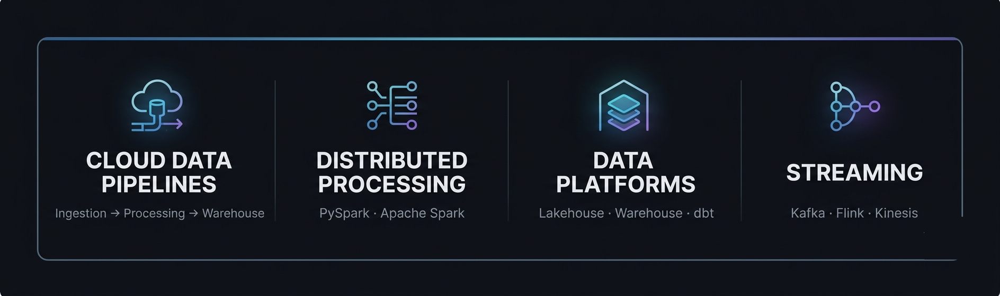
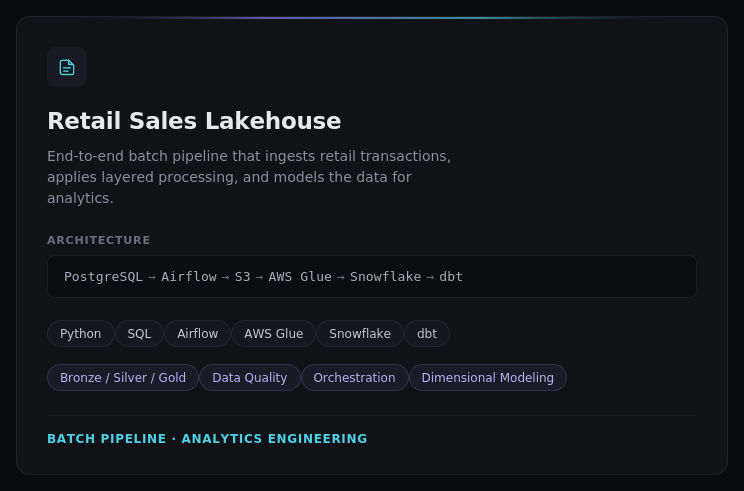
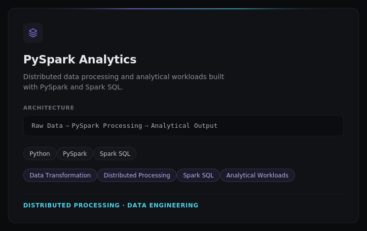

<!-- HERO -->

  

---

## About

Data Engineer with ~2.5 years of professional experience working at **Virtusa**, working with AWS-based data engineering systems in the banking and financial-services domain.

Professional work spans enterprise ETL workflows, Airflow orchestration, AWS Glue transformations, S3 data movement, Redshift loading, and production pipeline monitoring.

Outside of work, I build end-to-end data engineering projects focused on PySpark, modern data platforms, orchestration, cloud data pipelines, and analytical workloads.

---

## What I Build

  

---

## Stack

  

---

## Data Engineering in Banking

Experienced working in the **banking and financial-services domain**, building and supporting enterprise data pipelines, cloud-based ETL workflows, and analytical data platforms.

`Enterprise ETL` · `Airflow DAGs` · `AWS Glue` · `Amazon S3` · `Amazon Redshift`

`CloudWatch` · `SNS` · `Data Validation` · `Failure Investigation` · `Financial Data`

### Data Flow

`Source Data` → `S3` → `Airflow` → `Glue` → `Redshift` → `Monitoring`

---

## Featured Projects

  
  &nbsp;
  

---

## Certifications

  
  &nbsp;&nbsp;&nbsp;&nbsp;
  
  &nbsp;&nbsp;&nbsp;&nbsp;
  

---

## Connect

<a href="https://github.com/abii-18">
GitHub
</a>
&nbsp; · &nbsp;

<a href="https://www.linkedin.com/in/abinav-s18/">
LinkedIn
</a>
&nbsp; · &nbsp;

<a href="https://abinavfolio.pages.dev/">
Portfolio
</a>
&nbsp; · &nbsp;

<a href="mailto:abinavv018@gmail.com">
Email
</a>

